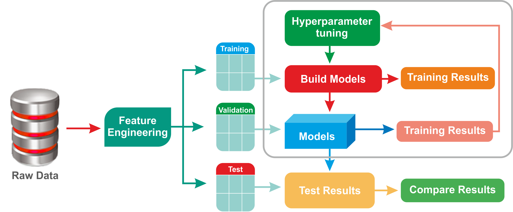

# Heart Failure Prediction
Belajar modeling pake Logistic Regression, Cross Validation, Hyperparameter Tuning, Data Preprocessing, dll

### TODO List
- [x] Belajar tentang Cross Validation dan Hyperparameter Tuning
- [X] Ngoding implementasi tentang Cross Validation dan Hyperparameter Tuning
	- [x] Compare performa before and after tuning
- [x] Ngoding lagi tapi pake dataset yang agak besar --> https://github.com/shandytp/customer_satisfaction_prediction

# Proses
1. Define a model
2. Define the range of possible values for all hyperparameters
3. Define a method for sampling hyperparameter values
4. Define an evalutative criteria to judge the model
5. Define a cross validation method

# Hyperparameter Tuning

- Parameter nya itu kita cari dari proses training, semisal kita mencari coefficient dan intercept dari Logistic Regression
- Kalo hyperparameter tuning, itu adalah value yang sudah kita tentukan sebelum proses training model. Ex: memilih regularization apa, parameter $\lambda$ berapa, mau berapa banyak iteration nya, max depth dari tree, jumlah k di kNN, dll
- Karena model kita tidak akan belajar dan nilai nya fix. Untuk menentukan parameter diatas manakah yang terbaik, melainkan itu user input.

Hyperparameter yang sering dipakai:
- GridSearchCV = combination dari masing - masing parameter, tapi computational heavy and expensive.
- RandomSearchCV = randomized dan akan mengurangi unnecessary computation

# Cross Validation
- Semisal kita ingin melakukan klasifikasi dengan 3 model yang berbeda, LogReg, SVM, kNN. Nah, kita bisa gunakan Cross Validation untuk mencari best model
- Kita split data yang satu blok itu menjadi training dan validation. Nah, untuk mencari blok mana yang bagus kita bisa menggunakan method Cross Validation. 
- Validation dataset ini akan mimic sebagai test set. Yang dimana itu nanti hasil parameter dari hyperparam akan kita coba di validation dataset ini. 

- Setelah mendapatkan best performance, maka nanti modelnya akan kita pakai di test data atau unseen dataset
- Jenis dari Cross Validation ada macam - macam, ex:
	- k-Fold Cross Validation
	- Stratified k-Fold Cross Validation (each criteria has the same proportion)
	- Leave One Out Cross Validation (LOOCV)
- Proses kerja dari k-Fold Cross Validation:
	1. Take the group as a holdout or "test" set or validation set
	2. Take the remaining groups as a training data set
	3. Fit a model on the training set and evaluate it on the test set
	4. Retain the evaaluation score and discard the model
- Ending nya proses diatas akan di summarize hasilnya 
